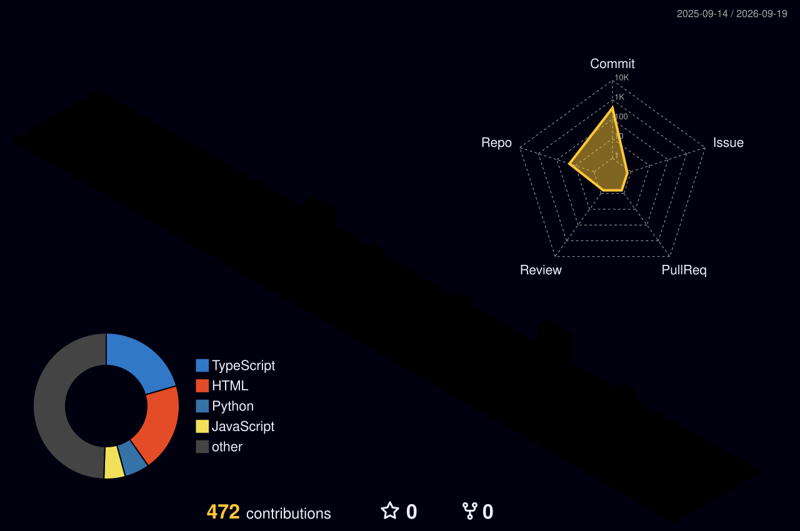

  

#   Ali Reza Shahvaran (He/Him), MSc  
### Research Assistant II (Geomatics Technician)

## ℹ️ About:
As an environmental scientist and engineer with a multidisciplinary background, I am passionate about leveraging technology to address complex environmental challenges. Over the past five years, I have integrated expertise in remote sensing, GIS, hydrologic modeling, and data science to specialize in environmental monitoring and climate change impact assessment.

Certified in advanced machine learning and deep learning, I combine programming proficiency in Python, MATLAB, and R with a deep understanding of Earth and environmental sciences. My work bridges the gap between traditional environmental engineering and cutting-edge geo- and hydro-informatics, enabling me to develop innovative, data-driven solutions. I am committed to sustainability and always eager to collaborate on projects that make a positive impact on our environment.

## 🔎 Areas of Focus:
* 💧 Water Resources Management | Hydrologic/Hydraulic Modeling | Water Quality Monitoring & Modeling
* 🛰️ Environmental Remote Sensing & Geographic Information Systems (GIS)
* 🌍 Climate Change Impact Assessment
* 🖥️ Artificial Intelligence (Machine Learning & Deep Learning) in Environmental Sciences | Geo-Hydroinformatics

## ⚙️ Technical Skills
  

## 🌐 Socials:

<h2 align="left">🚀 Coding Stats</h2>
<table width="100%" style="table-layout: fixed; border-collapse: collapse;">
  <tr>
    <td width="50%">
      <h3 align="left">&nbsp;&nbsp;🐙GitHub Stats</h3>
      

        
      

    </td>
    <td width="50%">
      <h3 align="left">&nbsp;🔥 Coding Streak</h3>
      

        
      

    </td>
  </tr>
  <tr>
    <td width="50%">
      <h3 align="left">&nbsp;🧠 LeetCode Stats</h3>
      

        
      

    </td>
    <td width="50%">
      <h3 align="left">&nbsp;💻 Language Breakdown</h3>
      

         
      

    </td>
  </tr>
</table>
 

<!-- 
  UNCOMMENT THIS SECTION IN THE FUTURE TO SHOW GITHUB TROPHIES
-->
<!--
## 🏆 GitHub Trophies

  

-->

## 📊 Contribution Model

  

